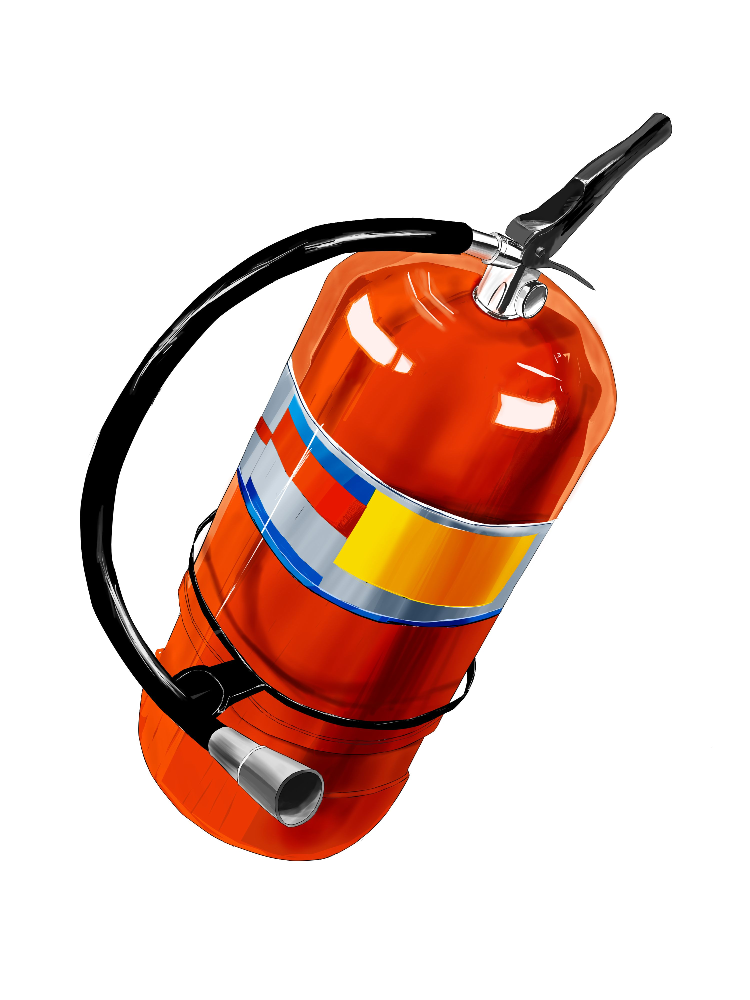

## 绘画的本质
> 以不变应万变的绘画基础

## 欢迎贡献！！！！
&emsp;&emsp;**欢迎各位对系列文章提出任何建议**，您可以提出 issue，或者 fork 本仓库对文章进行修改指正，甚至您可以将自己的文章加入系列，任何知识与建议都会令我感激不尽

点击这里👉 https://github.com/nooblesone/How-To-Draw-Anything-The-Essence-Of-Draw 或右上角 **GitHub 主页** 进入 GitHub 主页，期待您任何的互动、建议与贡献！

&emsp;&emsp;如果您的网络不方便访问 GitHub，请使用 Gitee 码云： https://gitee.com/nooblesone/How-To-Draw-Anything-The-Essence-Of-Draw

&emsp;&emsp;您也可以添加我的 QQ: 1052907018 或向我发送 Email: nooblesone@outlook.com 与我讨论！

<!--  -->

 

## 写在前面

各位好，我是泡面君。如果您正在学习绘画，或是打算学习但尚未开始，那么您可能会有这样的发现：
1. 几乎所有人都在劝你学素描
2. 当您想报班时，发现画室会有所谓的彩铅班、素描班、水粉班等各种画种的培训课程
3. 在学习时，跟着老师一笔一笔画，可以画的很好，但一到自己单独画就不会画了
4. 面对复杂的物体、大佬的画作，很难在脑中构建归纳其作画过程与思路
5. 不知道如何进行有效练习，自己的练习好像总是在浪费时间，花费了大量时间练习却收效甚微

&emsp;&emsp;以上及其他类似问题，是我们在初学绘画时经常遇到的，甚至部分有一定经验的画手也会或多或少的出现类似问题。我在早期的学习中也遇到了这些麻烦（小时候报的兴趣班，高考结束后踌躇满志报名某机构的魔鬼训练班，都遭遇了大失败）。屡次的失败让我怀疑起自己是不是不适合学画画。

&emsp;&emsp;所幸我在之后遇到了一位好老师，这位老师向我教授了他从美院学到的大量基础理论，并讲解了他所总结的“绘画的本质”，带领我做了一些练习。我才意识到原来**绘画是有一套系统的基础理论体系的**。从这套体系出发，可以概括几乎所有的画种，无论您是使用彩铅、蜡笔还是水彩、油画，甚至是国画或电子绘画，都可以基于这一套理论去进行有效练习。除此之外您还可以有章法的鉴赏名家画作，并具备一定的评价别人画作的能力（当然别忘了要礼貌得体的表达）。经过几个月的练习后，虽然我还是初学者的水平，但有了更多底气，也有了更好的思路去看待绘画这一事物，画技也取得了相对比较可观的进步。

&emsp;&emsp;为了帮助更多人能够更早的建立类似的绘画基础知识体系，也为了我本人巩固知识以及满足我希望像各位前辈学习的需求。我建立了这个仓库，把这套理论分享给各位，以助大家少走弯路，更早的开始自己的创作之路。

&emsp;&emsp;我会从基础的造型开始，为大家讲解绘画中基础的虚实、对比、体积、明暗与色彩等知识，以及一些有关创作的学习与思考。尽可能的将我脑中的知识系统的输出给大家，与各位共勉。

## 您可以在这里学到什么 or 学不到什么
> 您在这个系列可以学到什么
> - 一套系统的绘画基础体系知识，这套知识可以在您使用任何画种创作时帮助您更好的作画
> - 放之四海而皆准的万物起型法，主观分析光影的能力以及基础的色彩理论
> - 学习任何画种或技法都能做到提前胸有成竹，带有思考的练习和进步的能力
>
> 您在这个系列学不到的
> - 知识≠技能，健全的知识并不能替代您应有的练习量，绘画到底是一种技能而非知识
> - 虽然本系列会涉及一些基本的画面表现思路，如虚实对比疏密构图等，但对于更高阶的设计原则、美学造型、艺术表达等，本系列文章并没有涉及，我也没有足够的能力教别人这些（~~当然说不定未来就会有了~~）
> - 基本不涉及任何精确到画种的系统技法教学、软件教学等

## 系列文章列表（可能在未来会有增减，打勾为已完成）

- 起型篇
   1. [ ] [从框框开始起型吧](./articles/从框框开始起型吧.md)
   2. [ ] [把比例画准吧](./articles/把比例画准吧.md)
   3. [ ] [神奇的外轮廓](./articles/神奇的外轮廓.md)
   4. [ ] 观察也要有大局观
   5. [ ] 你是懂抽象的
- 简单构图设计篇
  - [ ] 透视？已经讲烂了啦
  - [ ] 虚实与对比-你的眼睛只能盯着一个地方看！
- 体积篇&&光影篇
  - [ ] 万物皆是形状，万物都有体积
  - [ ] 体积是线条表现出来的哦！
  - [ ] 再论起型
  - [ ] 一个光源就够啦！
  - [ ] 有体积的话，明暗就是洒洒水啦
- 色彩篇
  - [ ] 明度？纯度？色相？什么玩意
  - [ ] 色彩三原色不是RGB哦
  - [ ] 调色才没什么难的呢
  - [ ] 物体本身的颜色就是固有色哦
  - [ ] 有颜色要怎么加光影嘛
  - [ ] 环境色也是要掺和进来的
- 场景篇&&综合篇
  - [ ] 物体是放在场景中滴
  - [ ] 来张大练习吧
- 杂项&&思考&&加餐篇
  - [ ] 没有基础就不要谈技巧啦
  - [ ] 先不要去研究风格
  - [ ] 素描到底有没有必要学
  - [ ] 知识是活的，体系是活的，人也是活的，艺术更得是活的
  - [ ] 用导演思维看待一张画的创作
  - [ ] 熟读唐诗三百首，不会吟诗也会吟
  - [ ] 文似看山不喜平，画如交友须求淡

## 写在最后&&欢迎贡献！！
&emsp;&emsp;如您所见，这个系列目前尚未完结，将知识整理输出是一个大工程，我恐怕不能在短期内完成它，也请朋友们多多包涵，耐心等待。

&emsp;&emsp;**欢迎各位对系列文章提出任何建议**，您可以提出 issue，或者 fork 本仓库对文章进行修改指正，甚至您可以将自己的文章加入系列，您也可以添加我的 QQ：1052907018 或向我发送 Email: nooblesone@outlook.com 与我讨论！

&emsp;&emsp;本系列文章永远开放免费！内容在未来也不会局限于基础知识，我希望能力提升也可以带动这个仓库的成长，放入更多优质与高阶的内容，希望这个系列与我可以陪伴大家共同进步，持续成长。