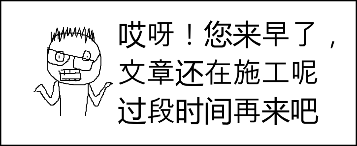
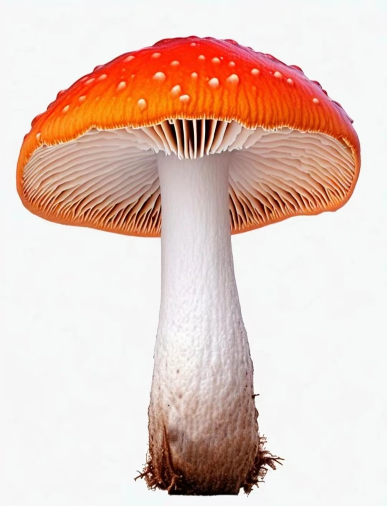
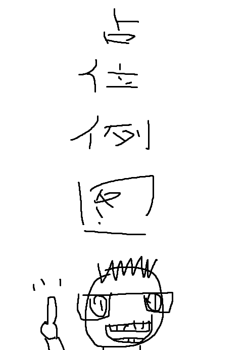

## 从框框开始起型[小白级]

> 注意：本文正在施工中

难度：小白级

## 总之先画一张画吧

当我们在学习我们应该怎么做的时候，我们首先更应该理解它为什么要这么做，所以，请让我们用一副画来开始我们的绘画之旅

如果您确定自己是一位零基础小白的话，请尝试画这张画。可以的话请不要把它画的太小，尽可能在长度大于 15cm 的纸张上作画。

不限制时间，但是尽可能快哦

- 这
- 是
- 一
- 列
- 占
- 位
- 字

好了，现在我们看一下这张画，如果您的确是没有特意练习过起型技法的零基础小白的话，您画出来的画有可能会是这样的：

好好，先别急着打我，我承认这张画有夸张的成分，肯定是不如您刚刚的作品的！

这张画中有一些典型的问题可能是需要您注意的，不过这些问题我们暂且按下不表。

现在是时候为大家介绍本文的主题了：

> 我们应当使用何种方式，来开启一幅画的创作呢？

从标题我们其实已经知道了：**框框起型法**

## 画之前先打框吧

现在让我们重新观摩下这张原图，我做了一些处理

我们加好了红色的方框，现在我们把原图隐藏

多加几笔

您是不是看出点什么了？我们继续细化

擦掉多余的线

一张蘑菇就出来啦！

是不是感觉很神奇呢，其实这就是很多画家们，在画画时所进行的**打型**阶段，它大致有以下几个步骤

- 确定物体在纸张上的位置，找出上下左右四个点，如果物体是对称的画，还要画出中心线
- 将物体的几个关键位置概括成方框
- 在方框中，切出大致形状
- 在以上打好的基础形体上，描出物体，然后擦掉辅助线

> 请注意，在上方的示范中，有一个步骤被省略掉了，您能看出来是哪步吗？
> 当然看不出来也没有关系，跟着下面的实践继续分析吧！

下面我们在用几个物体来实践一下

> 待施工

相信看了这些示例后，至少，您的大脑已经掌握了这项技能，那么恭喜您！您已经掌握了最最基础的绘画技能，踏出了绘画的第一步，祝您以此为起点，能够在未来成为一名妙手丹青的大画家。

那么现在我们留一点家庭作业吧（

## 作业

> - 使用今天学到的技能，重画一遍文章最开始的例图，并和您画的第一张图对比
> 
> - 挑几张本文的示例画一画，或者您可以自己寻找一下生活中的物体尝试将它画出来，但是不要找太过复杂的哦

## 小加餐

### 方框是必须要画的吗？

正如我们本文开头所说的，知其然要知其所以然，不知您有没有思考过，画方框这个步骤，到底有什么用呢？为什么画了方框，画面效果就会更好呢？

为此，我们有必要再来梳理下，我们打型的步骤和目的。

打型的几个步骤，无非就是确立高低点，和画出方框并切出形状

当我们找出物体在纸张中的高低点、左右点后，实际上我们已经**确立了物体在画面中的位置**

而以此为基准，我们根据物体关键部分画出的方框，也是帮我们**确认了物体某部分在物体中的位置**

在提前确立好了这些东西后，您会发现，您所画的区域就已经被限定了，您是**不能把笔触画出这些框定的区域**的，而且因为这些方框帮您**框定好了这个画面的结构和大小**，只要框没画错，您最后出的图也同样不会出现严重的比例失衡，大小错位的情况。由此我们可以得出结论，画框的目的可以总结为**限制**和**规整**

那么回到我们先前的问题，方框是必须要画的吗？

答案当然为否了，既然我们画框的目的是为了限制和规整，那如果我们有其他办法来搞定这件事的话，那画框这一步骤当然可以省略，只不过对于初学者来说，大框是最易学，也是效果最好的方式。

如果您足够熟练，对一个物体能够“胸有成竹”，落笔即完美，您当然是不必画这个框的，有一些画种比如国画，正是要这种一笔喝成的气势，画太准反而是局限了

### 方框必须是方的吗？

其实也未必，实际上您的框可以是三角形，梯形，以及任何不规则的四边形，为不同的物体找到最合适的形状进行概括，自然是最好的，只不过一般来讲方形适用的场景最多，也最不易出错